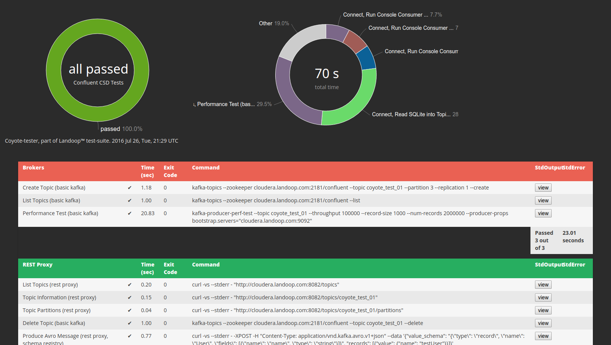

# Coyote Tester #

Part of Landoop™ test suite.

---

_Coyote_ is a test agent. It uses a yml configuration file with commands to setup
(stdin, env vars, etc) and run. It checks the output for errors and may further
search for the presence or absence of specific regular expressions. Finally it
creates a html report with the tests, their outputs and some statistics.

The exit code of _coyote_ is the number of failed tests, up to 254 failed tests.
For 255 or more failed tests, the exit code will remain at 255.

Some advanced functionality includes creating unique strings or skipping groups
of tests. We use it within our Continuous Integration procedures (Jenkins
based), thus we need it to be somewhat manageable through automated procedures.
Still, we try to keep things simple and add things as we go. This is
_guerilla programming_. :)

To build:

    go generate
    go build

To execute with a simple configuration file:

    ./coyote-tester -c conf.yml

The best example for understanding how to setup a coyote test, would be the
[kafka-tests.yaml](https://github.com/Landoop/coyote/blob/master/kafka-tests.yml)
which we use to test our Confluent Platform setup for the
[Landoop Boxes](https://docs.landoop.com/pages/your-box/).

*Important:* coyote stores the stderr and stdout of each command in memory, so
it isn't suitable for testing commands with huge outputs.



## Simple Examples

Sample entry in configuration yml file:

```
- name: Test 1
  entries:
    - name: Command 1
      command: ls /

    - name: Command 2
      command: ls
      workdir: /home

    - command: ls /proc
      nolog: true
```

Advanced options:

```
- name: Test 2
  entries:
    - name: Long running command
      command: cat
      timeout: 300s
      stdin: hello

```

## Skip

An option you may add to your groups or per command is `skip`. This option will
skip the test if set to (case insensitive) `true`. Please note that this isn't
a boolean option but rather a string.

The idea behind it is that you can have a test like this:

```
- name: test 1
  skip: _test1_
  entries:
   ...
   ...
- name: test 2
  skip: _test2_
  entries:
   ...
   ...
```

And then you can easily switch off parts of the test using sed or other tools.

# License

We chose GPLv3 for this project. See COPYING for more information.
